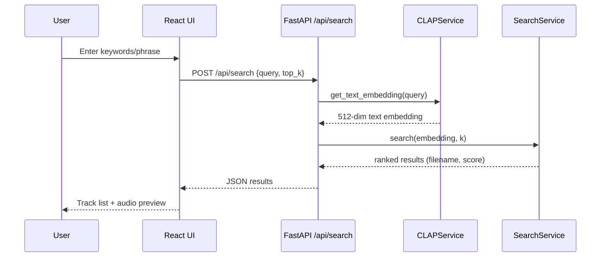
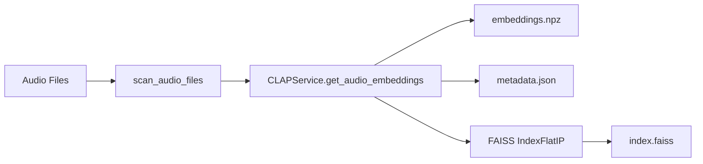

# Sound Retrieval via Keyword Spotting (LAION CLAP)

## Executive Summary
This R&D project delivered a working demo for keyword-based sound retrieval using the LAION CLAP (Contrastive Language-Audio Pretraining) model. The system maps text queries and audio clips into a shared embedding space, enabling semantic retrieval of sounds from natural language descriptions (keywords/phrases). The integration is complete end-to-end: offline audio embedding generation, FAISS-based similarity search, FastAPI inference endpoints, and a React demo UI. The demo meets the intended goals and validates CLAP as the primary retrieval engine.

## Requirements & Scope
### Functional Requirements
- Accept natural language keyword/phrase queries for sound retrieval.
- Generate text embeddings via LAION CLAP and compute similarity to audio embeddings.
- Pre-compute and persist audio embeddings for fast query-time search.
- Return ranked results with filename, similarity score, and audio preview URL.
- Provide a responsive web UI with a search bar, list of results, and audio playback.

### Non-Functional Requirements
- Fast query response using an in-memory index (FAISS).
- Model auto-detection for GPU (CUDA/MPS) or CPU fallback.
- Clear error handling for missing files, model errors, or playback issues.
- Maintainable separation between model service, search service, API layer, and UI.

### Out of Scope
- Online fine-tuning or user-upload workflows (not integrated in the demo).
- Large-scale approximate search (e.g., IVF/HNSW) beyond current in-memory index.

## Theoretical Foundation (LAION CLAP)
LAION CLAP is a contrastive multi-modal model that learns to align text and audio in a shared latent space. It uses:
- **Audio encoder**: HTSAT-tiny (audio spectrogram transformer).
- **Text encoder**: RoBERTa.
- **Shared embedding**: 512-dimensional vector for both modalities.
- **Objective**: Contrastive loss that pulls matching audio-text pairs together and pushes non-matching pairs apart.

At inference time:
1. Text queries (keywords/phrases) are encoded into a 512-dim text embedding.
2. Audio files are encoded into 512-dim audio embeddings.
3. Similarity is computed via cosine similarity (inner product on L2-normalized vectors).
4. The most similar audio clips are returned as search results.

## Technical Solution & Architecture
### Core Components
- **Backend**: FastAPI for inference APIs and static audio serving.
- **Model Service**: `CLAPService` wraps `laion_clap.CLAP_Module`.
- **Search Service**: `SearchService` uses FAISS IndexFlatIP for cosine similarity.
- **Offline Embedding Pipeline**: CLI script to scan audio files, generate embeddings, and persist index + metadata.
- **Frontend**: React (Vite) demo with a search bar and Spotify-like track list.

### Inference Pipeline (Mermaid)

### Offline Embedding Generation (Mermaid)

## Implementation Walkthrough
### 1. Audio Discovery
- **File**: `backend/app/utils/audio_loader.py`
- **What it does**: Recursively scans `backend/data/audio` for supported formats (`.wav`, `.mp3`, `.flac`, `.ogg`, `.m4a`).

### 2. Embedding Generation (Offline)
- **File**: `backend/scripts/generate_embeddings.py`
- **What it does**:
  - Loads CLAP model via `CLAPService`.
  - Generates audio embeddings in batches.
  - Persists artifacts:
    - `embeddings.npz` (audio embeddings + filenames)
    - `metadata.json` (filenames + file paths)
    - `index.faiss` (FAISS IndexFlatIP for similarity search)

### 3. CLAP Integration
- **File**: `backend/app/core/clap_service.py`
- **What it does**:
  - Auto-detects device: CUDA → MPS → CPU.
  - Loads the CLAP checkpoint (`630k-audioset-best.pt`) via `load_ckpt()`.
  - Exposes:
    - `get_text_embedding(text)` → 512-dim vector
    - `get_audio_embeddings(file_paths)` → N x 512 vectors

### 4. Similarity Search
- **File**: `backend/app/core/search_service.py`
- **What it does**:
  - Loads persisted embeddings and index (if available).
  - Normalizes embeddings for cosine similarity.
  - Uses `IndexFlatIP` to return top-k neighbors.
  - Normalizes similarity scores to `[0, 1]` for the API contract.

### 5. API Layer
- **File**: `backend/app/api/routes.py`
- **Endpoints**:
  - `POST /api/search`: returns ranked audio results.
  - `GET /api/health`: readiness + model loaded.
- **Static audio**: Served under `/audio` via FastAPI StaticFiles.

### 6. Demo UI
- **Files**: `frontend/src/App.jsx`, `frontend/src/components/*`
- **What it does**:
  - Captures user queries and triggers API search.
  - Renders a Spotify-like list view with inline audio previews.
  - Displays similarity as a percentage badge.

## Results & Discussion
### Demo Performance
- The demo successfully retrieves semantically relevant sounds based on keyword phrases.
- Query latency is dominated by CLAP text embedding + FAISS search and is performant for the current dataset.
- Precomputed embeddings enable fast, repeatable searches without reprocessing audio.

### Observations
- CLAP handles descriptive phrases well (e.g., “gentle rain”, “laser blast”).
- Audio results are ranked consistently with subjective expectations in the demo.
- Embedding quality is strong out-of-the-box with the default checkpoint.

### Limitations
- No domain-specific fine-tuning yet; retrieval is general-purpose.
- Long audio files are not chunked in the demo pipeline.
- No approximate index or distributed search for large-scale corpora.

## Future Work
- **Model fine-tuning**: Adapt CLAP to domain-specific audio libraries.
- **Chunking or fusion**: Improve accuracy for >10s audio files.
- **Scalable indexing**: Move to FAISS IVF/HNSW for large datasets.
- **Hybrid retrieval**: Combine semantic retrieval with keyword/tag filters.
- **Evaluation metrics**: Add formal benchmarks (mAP, nDCG) and human evaluation.
- **Upload pipeline**: Add async ingestion and embedding of new audio files.

## Appendix: Key Code References
- CLAP integration: `backend/app/core/clap_service.py`
- Search service: `backend/app/core/search_service.py`
- API endpoints: `backend/app/api/routes.py`
- App startup: `backend/app/main.py`
- Embedding generator: `backend/scripts/generate_embeddings.py`
- Audio scanning: `backend/app/utils/audio_loader.py`
- Frontend demo: `frontend/src/App.jsx`, `frontend/src/components/*`
